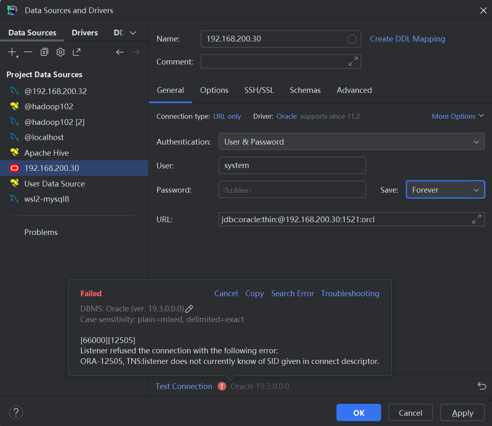

### 2025-10-15
今天我在安装oracle时，我安装的位置不对导致我浪费了很多时间然后，最后我在连接datagrip报错争取明天完成

### 2025-10-16

今天上午我将oracle连接datagrip报错时我发现是我的监听器未注册SID时没有注册成功，
然后就开始连接数据库然后报错，然后我对SID进行重新注册，然后解决了这个问题,
今天下午和晚上我就开始在阿里云上的mysql和MaxCompute的连接然后再使用dataworks当中的同步了数据库

### 2025-10-17

今天上午我将datagrip和idea连接maxcompute，
然后我下午和晚上将工单做了一下表已经建成功了数据也进去了然后就差在dataworks连接hive然后将数据导入到hive
